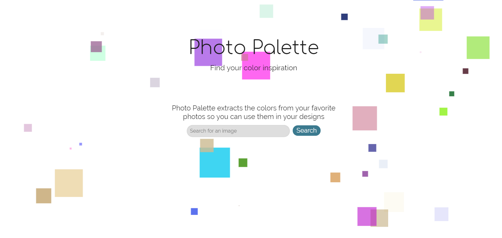
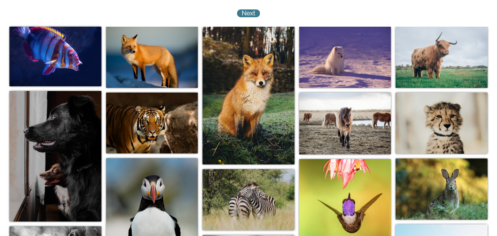
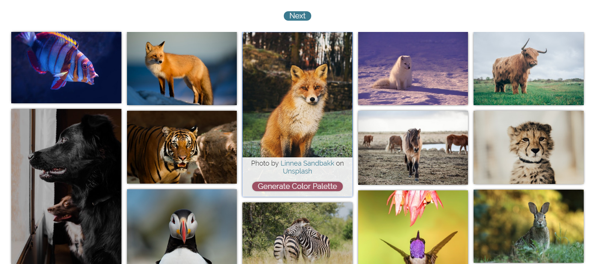
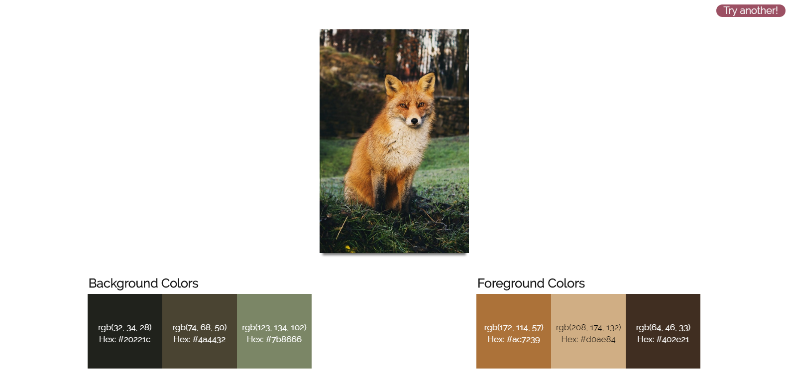

# Photo Palette

A design tool for color inspiration. Users can search through high quality photos and select those that are particularly eye catching. The user is then able to generate a color palette, complete with RGB and HEX values of the selected photo's colors, that they can utilize in other design projects. 

## Demo
Check out the [Live Demo](https://jollendi91.github.io/photo-palette-generator/)

## Screenshots

Landing Page/Photo Search: 

Search Results:

Selected Photo View:

Color Palette:

## Built With

### Front-End

- HTML
- CSS
- JavaScript
- jQuery

### APIs

- [Unsplash](https://unsplash.com/developers) - For photo search
- [Imagga Color Extraction](https://docs.imagga.com/#colors) - To get colors from the selected photo
